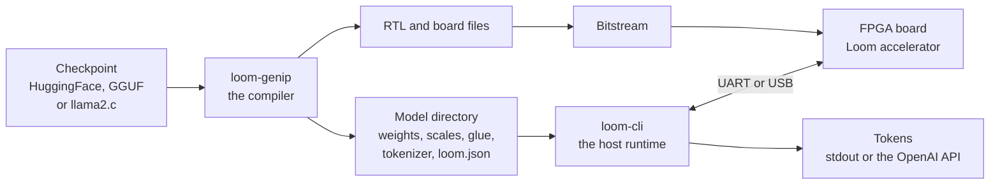

# loom

Weave LLMs into RTL.

Loom is an end-to-end toolchain that runs language models on FPGAs. It
compiles a model checkpoint into RTL for a Wishbone SoC accelerator, which it
builds with [ROHD](https://github.com/intel/rohd) and
[Harbor](https://git.lilithsemi.com/LilithSemi/harbor). It then drives text
generation from the host with a Zig runtime, which also serves an
OpenAI-compatible HTTP API.

- **Inputs**: HuggingFace `safetensors`, GGUF and llama2.c `.bin` checkpoints.
- **Targets**: Lattice ECP5, Lattice iCE40 and Xilinx 7-series parts. One flag
  selects the board or the part. The OrangeCrab ECP5 is the default, and it is
  the board that Loom runs on today.
- **Scale**: small models on small parts. Think llama2.c `stories260K` on an
  ECP5 25F, not a 70B model on a datacenter card.

The demo datapath splits the work. The FPGA does the linear algebra with the
W4A8 engine of the `fp` SoC: int4 weights from config flash, DDR3 or on-chip
BRAM, against int8 activations, into int32 accumulators, with fp16 at the
boundary. The host does the nonlinear glue: the embeddings, RMSNorm and
LayerNorm, RoPE, softmax, SiLU and GELU, the sampling, the MoE routing and the
image preprocessing.



## Pipeline

1. **Fetch a model**, or point at a checkpoint that you have:

   ```
   loom-cli fetch --repo <owner>/<name> --out model
   ```

   This downloads `config.json`, `tokenizer.json` and the safetensors weights
   from HuggingFace. It follows the index of a sharded checkpoint. GGUF and
   llama2.c files also work. See [docs/models.md](docs/models.md).

2. **Generate the IP:**

   ```
   loom-genip --soc fp --fp-flash --model model -o out
   ```

   This writes the SystemVerilog of the SoC, the device tree, the SVD file,
   the pin constraints and a Makefile for the flow of the target. It also
   writes the artifacts that the runtime reads: `weights.bin`, `scales.bin`,
   `scales_flash.bin`, `glue.bin`, `tokenizer.bin` and the `loom.json`
   manifest. See [docs/genip.md](docs/genip.md).

3. **Build and flash** the bitstream and the weight image. Run `make` in the
   output directory, then use the programmer of your board. On the OrangeCrab
   the weight image goes at `ecpprog -o 0x200000`. See
   [docs/flashing.md](docs/flashing.md) for the steps and the offsets, and
   [docs/hardware.md](docs/hardware.md) for the targets and the memory map.

4. **Generate or serve** from the host:

   ```
   loom-cli generate --model out --prompt "Once upon a time"
   loom-cli serve --model out --listen 8080
   ```

   Every transformer matmul runs on the device, and each token streams back as
   it lands. `serve` gives `GET /v1/models` and `POST /v1/chat/completions`,
   as a stream or as one response. See [docs/runtime.md](docs/runtime.md).

## Repository layout

| Path | What lives there |
| ---- | ---------------- |
| `ip/` | The `loom` Dart package: the model-to-RTL compiler. It holds the frontends for HuggingFace, GGUF and llama2.c, a typed model IR, the weight loaders, the int4 image packer, a golden reference model, and the ROHD and Harbor hardware library. It installs the `loom-genip` tool. |
| `runtime/` | The Zig host runtime: the `loom` library, the `loom-cli` binary with the UART and USB transports, generation, the OpenAI-compatible server and the HuggingFace `fetch`, plus the C, C++ and Python bindings. |
| `pkgs/` | The Nix packages `loom-ip` and `loom-rt`, which build the two above. |
| `flake.nix` | The flake-parts flake: the packages, the dev shells `ip` and `rt`, and treefmt. |

The tree builds with Nix on `x86_64-linux` and `aarch64-linux`:

```
nix develop          # the Dart toolchain, the same as .#ip
nix develop .#rt     # the Zig toolchain and a python env
nix build .#loom-ip .#loom-rt
```

In the shells, run `dart test` in `ip/` and `zig build test` in `runtime/`.
Format the tree with `nix fmt`. See
[docs/getting-started.md](docs/getting-started.md).

## Documentation

- [docs/README.md](docs/README.md) - the index of every page
- [docs/getting-started.md](docs/getting-started.md) - the dev shells, the packages and the first commands
- [docs/architecture.md](docs/architecture.md) - the compiler, the SoC variants and the memory map
- [docs/genip.md](docs/genip.md) - the `loom-genip` compiler and the `loom.json` manifest
- [docs/models.md](docs/models.md) - the model formats, the quantization and the size limits
- [docs/hardware.md](docs/hardware.md) - the targets and boards, the weight stores and the transports
- [docs/flashing.md](docs/flashing.md) - how to build a bitstream and write it to a board
- [docs/runtime.md](docs/runtime.md) - `loom-cli`, the server and the bindings
- [docs/testing.md](docs/testing.md) - the test suites, the simulator and the board checks
- [docs/debugging.md](docs/debugging.md) - how to find the layer that is broken
- [docs/status.md](docs/status.md) - what works today, and what does not
- [docs/glossary.md](docs/glossary.md) - short definitions of the terms

## Status

This is early research code at version 0.0.1. The `fp` SoC with the weights in
flash has run `stories260K`-class models end to end on an OrangeCrab r0.2. The
`overlay` and `stream` SoCs are earlier bring-up steps, and parts of
`ip/lib/src/hw/` are exploratory. Expect rough edges. See
[docs/status.md](docs/status.md).

## License

Apache-2.0. See [LICENSE](LICENSE).
