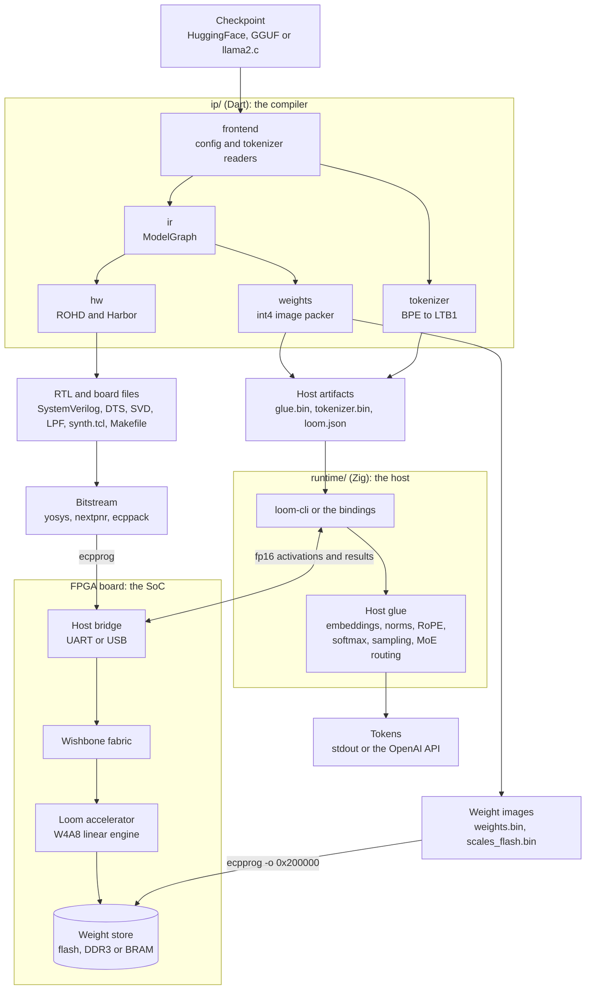
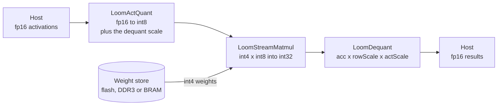

# Architecture

Loom has three parts: a compiler, an SoC, and a host runtime.

1. The **compiler** (`ip/`) changes a model checkpoint into RTL, weight images
   and a manifest.
2. The **SoC** runs on the FPGA. It holds a Wishbone fabric from
   [Harbor](https://git.lilithsemi.com/LilithSemi/harbor), a transport bridge
   and the Loom accelerator.
3. The **runtime** (`runtime/`) speaks the transport, drives the model, and
   gives you a CLI, an HTTP API and a C ABI.

## The compiler (`ip/lib/src/`)

| Directory | Role |
| --------- | ---- |
| `frontend/` | Reads the model sources. `hf_config.dart` reads a HuggingFace `config.json`. The `gguf_*` files read GGUF metadata and tokenizers. `model_source.dart` gives one view of a model on disk. |
| `ir/` | The typed model IR. `ModelGraph` holds the layers, the attention and MLP specifications and the dimensions. Everything downstream reads it. |
| `weights/` | The weight loaders for safetensors, sharded safetensors, GGUF and llama2.c. `flash_image.dart` packs the weights into the tile-major int4 image with parallel fp16 scales, and writes the matrix manifest. |
| `golden/` | A Dart model of the quantized forward pass. The tests compare RTL and silicon against it. It also holds research tools for GPTQ, SVD, MoE, MTP and vision. |
| `hw/` | The ROHD hardware library: the PE array, the vector unit, the matmul and linear engines, the three accelerator tops, the UART and USB bridges, the fp16 blocks and the sequencers. |
| `tokenizer/` | The HuggingFace BPE reader, the LTB1 writer and the llama2.c SentencePiece reader. |
| `runtime/` | Dart device drivers. The golden path uses them to drive real hardware. |
| `nano/` | `nano_model.dart`, a compact model description. |

## The SoC

`loom-genip` builds a Harbor `HarborSoC`. The SoC holds a host bridge and a
Loom accelerator on a Wishbone fabric. The host bridge is the only bus master
for commands. Harbor adds an arbiter when the accelerator also reads weights.
`soc.generateAll()` then writes the SystemVerilog, the device tree, the SVD
file, the pin constraints, the yosys script and a Makefile.

### Variants (`--soc`)

| Variant | Accelerator | Memories | Notes |
| ------- | ----------- | -------- | ----- |
| `overlay` | `LoomAccelerator`, an 8x8 PE array. A plain bus slave. | none | The first bring-up SoC. A 12-bit fabric that runs at the board oscillator. USB or UART. |
| `stream` | `LoomStreamAccelerator`, a memory-backed int8 matmul. | SRAM scratchpad, optional DDR3 | The first SoC that keeps weights and activations in memory. UART only. |
| `fp` | `LoomFpLinearAccelerator`, an fp16-in and fp16-out W4A8 linear engine. | SRAM scratchpad, optional BRAM cache, optional DDR3, optional resident flash | The datapath that runs models. UART only. |

### The host and device split (`--soc fp`)

The device does the linear algebra. `LoomFpLinear` is the compute block that
the sequencer builds for each projection and each MLP matrix. It holds the
quantization boundary around the integer matmul:

1. `LoomActQuant` buffers the fp16 activations and quantizes them to int8. It
   also gives the fp16 scale for the dequantization step.
2. `LoomStreamMatmul` multiplies int4 weights by the int8 activations into
   int32 accumulators. The weights come from `mem`, which decodes to flash, to
   DDR3 or to BRAM.
3. `LoomDequant` scales each row back to fp16 with `acc * rowScale *
   actScale`.

The host does the rest: the embedding lookup, RMSNorm and LayerNorm, RoPE, the
attention softmax, SiLU and GELU, the sampling, the MoE routing and the image
preprocessing. The weights for that work go into `glue.bin` as fp16. They are
not in the int4 image.

### Memory map (`stream` and `fp` SoCs)

| Base | What lives there |
| ---- | ---------------- |
| `0x00000000` | On-chip SRAM scratchpad for activations and results. |
| `0x00010000` | Accelerator CSRs. |
| `0x20000000` | Weight store: DDR3 or resident SPI flash. |
| `0x30000000` | BRAM hot-weight cache (`--fp-bram-cache-kb`). |

The `overlay` SoC uses a 12-bit fabric and puts the accelerator at `0x000` in
a 2 KiB window. The flash images sit above the bitstream at byte offset
`0x200000`, and the scales sit above the weights on a 64 KiB boundary. See
[hardware.md](hardware.md#memory-map).

### Clocking

The board oscillator runs at 48 MHz.

- `overlay` runs directly from the oscillator.
- `stream` runs from the oscillator. With `--ddr` it runs from the PLL at
  `--fp-mhz` instead, because DDR3 does not close timing at 48 MHz.
- `fp` runs from the PLL. The default is 30 MHz. The placed design closes at
  approximately 37 MHz, and 30 MHz makes the default 1.5 Mbaud UART an exact
  divisor.

## The runtime (`runtime/`)

`lib/loom.zig` is the library root. `src/main.zig` is the `loom-cli` entry
point.

| Module | Role |
| ------ | ---- |
| `device.zig` | The backend-independent `Device` interface that the model runner drives. |
| `transport.zig`, `uart.zig`, `usb.zig` | The silicon backends over UART and USB. |
| `protocol.zig` | The wire protocol for register and buffer access. |
| `fp.zig` | The CSR map of the fp accelerator. |
| `quant.zig` | The golden int8 matmul that the CLI compares against. |
| `model.zig` | Loads a `loom-genip` output directory. |
| `linear.zig`, `ops.zig`, `forward.zig` | The W4A8 forward pass, the host ops and the generation loop. |
| `vision.zig`, `image.zig` | The vision tower and the JPEG decoder. |
| `tokenizer.zig`, `bpe.zig` | The LTB1 tokenizer, with UTF-8 safe streaming. |
| `engine.zig`, `serve.zig`, `net.zig` | The OpenAI-compatible HTTP server. |
| `sim.zig` | An in-process device that the tests and the bindings use. |

The C, C++ and Python bindings in `bindings/` wrap one C ABI over the same
core. `forward.generate` runs against silicon or against the simulator with no
change in the caller. See [runtime.md](runtime.md#bindings).

## Verification

- The Dart golden model holds the reference forward pass. The RTL tests and
  the silicon results must agree with it.
- `loom-cli matmul` runs a fixed int8 matmul on an `overlay` board and
  compares it against `quant.matmul` in Zig.
- `sim.zig` runs the whole generate path with no hardware.
- `loom-genip --model` writes `tokenizer_fixture.json`, which gates the
  runtime tokenizer against the compiler tokenizer.

See [testing.md](testing.md) for the commands.
